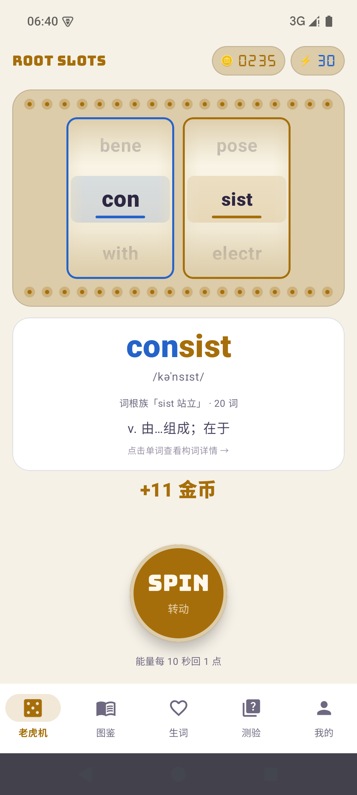
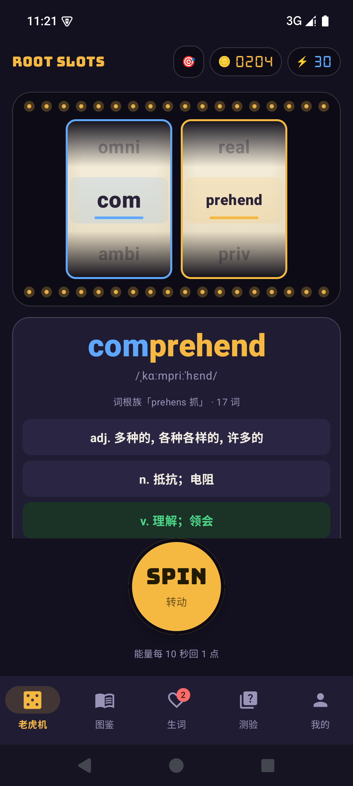
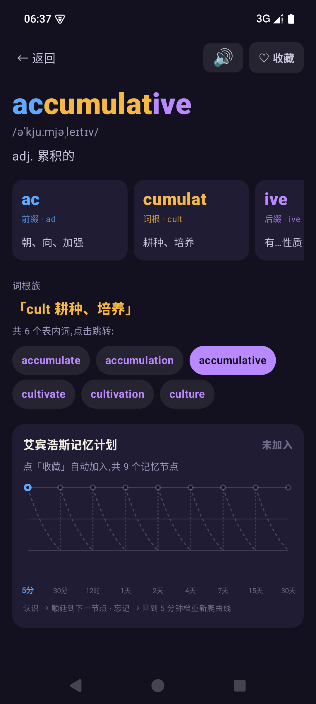
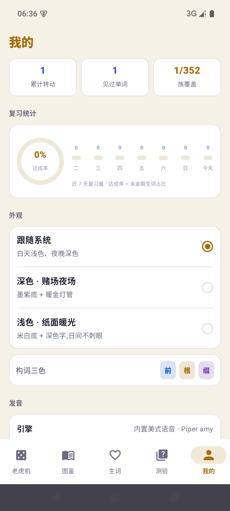
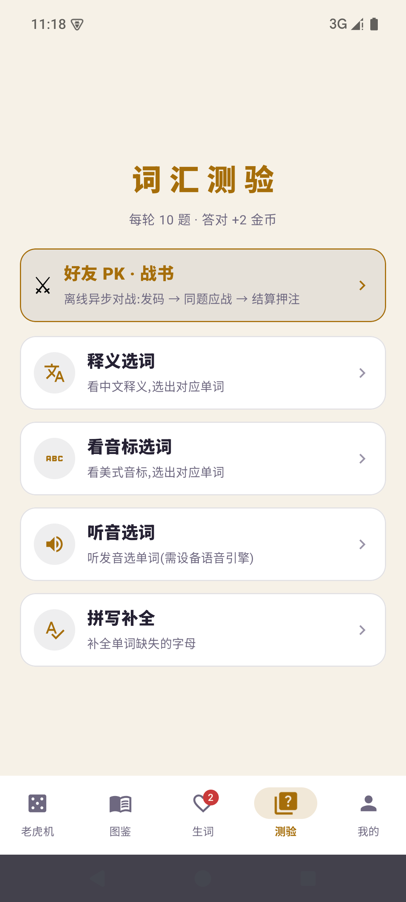
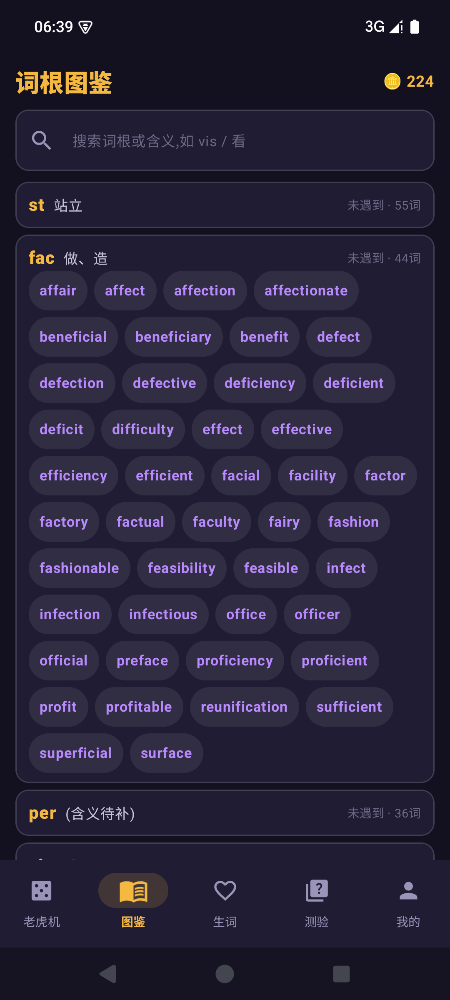

# 🎰 词根老虎机 RootSlots

> 像拉老虎机一样背单词——转轴停下的**必然是 CET-4 词表里的真词**:
> 前缀蓝、词根金、后缀紫,在娱乐中完成构词记忆。


**下载**:到 [Releases](https://github.com/amazing1102/RootSlots/releases) 页面下载 `RootSlots-v1.0.0.apk`,Android 8.0+ 直接安装。

---

## ✨ 功能

| 模块 | 说明 |
|---|---|
| 🎰 **动态段轴老虎机** | 轴数 = 词段数(2~4),每根轴按段类型着色(前缀蓝/词根金/后缀紫),停轴左→右逐段点亮,完整真词大字随停轴显色;金币、连击、能量回充 |
| 🔍 **构词详情双形态** | 2278 个组合词=分段释义卡(每段的词根含义);其余词=整词卡;词根族一键跳转 |
| 🧠 **艾宾浩斯 SRS** | 经典 9 记忆节点(5分钟→30分钟→12小时→1/2/4/7/15/30天),通过即毕业;详情页绘制该词的记忆保持率曲线 |
| ✍️ **四模式测验** | 释义选词 / 看音标选词 / 听音选词 / 拼写补全,覆盖全词表 |
| 📚 **词根图鉴** | 354 个词根族 + 搜索 + 收集进度,转过的词金色点亮 |
| 🔊 **离线神经美音** | 内置 sherpa-onnx + Piper(en_US-amy)语音模型,无网也能自然发音;系统 TTS 自动兜底 |
| 🌓 **明暗双主题** | 赌场夜场(墨紫+暖金)/ 纸面暖光(米白+深金),跟随系统或手动锁定 |
| 📊 **复习统计** | 近 7 天复习量柱状图 + 记忆曲线达成率 |

## 📸 截图

| 老虎机 | 深色主题 |
|---|---|
|  |  |
| **单词详情**(IPA + 分段 + 记忆曲线) | **我的页**(复习统计 + 设置) |
|  |  |
| **看音标选词** | **词根图鉴** |
|  |  |

## 🛠️ 技术栈与亮点

- **Kotlin 2.0 + Jetpack Compose**(Material3)+ **Room** + **DataStore**,零网络权限、零第三方 SDK
- **自研构词数据管线**(Python):从四份词根词缀 md 源表解析,用受约束 DFS 拆分真词——
  族键整段回退、词尾后缀优先、族链强验收,2278 个组合词拆解 **0 错误**;
  拆不可靠的词自动退回"整词模式",宁可不拆不硬拆
- **CMUdict → 美式 IPA 转换器**:ARPAbet 映射 + 音节 onset 重音插入,覆盖 **98.2%** 词表
- **Room 幂等自愈预填**:`ensurePrefilled()` 不依赖 onCreate 时机,破坏性迁移后自动从 assets 重灌
- **离线神经语音**:`SpeechEngine` 抽象——启动即用系统 TTS,Piper 就绪(约 1.5s)后无感切换;
  generation 计数实现"新播报打断旧播报"
- **体积工程**:R8 + 资源收缩 + ABI 裁剪(arm64-v8a/x86_64),63MB 语音模型打进 APK 仅 **137MB**

## 🏗️ 数据管线

```
cet4 词表/词根词缀/组合图谱 (md)
        │  tools/build_data.py   (解析 + DFS 拆分 + 释义/音标合并 + 校验)
CMUdict ─ tools/build_ipa.py    (ARPAbet → 美式 IPA)
        ▼
assets/{words, morphs, families, combos, ipa}.json
        │  首次启动幂等预填
        ▼
Room (DB v6: words / morphs / families / combos / srs / review_logs …)
```

数据与代码分离:改 md 源表或释义批文件(`assets/glosses/*.json`)后跑一遍管线即可全量重建。

## 🔨 本地构建

```bash
# 数据管线(md/释义变更后)
python tools/build_ipa.py && python tools/build_data.py && python tools/verify_assets.py
cp assets/{words,morphs,families,combos}.json RootSlots/app/src/main/assets/

# Debug 构建
cd RootSlots && ./gradlew assembleDebug   # 或 gradle.bat(见 AGENTS.md)

# Release 构建(需自备签名:根目录放 keystore.properties + release.keystore)
gradle assembleRelease
```

- 工具链:Android Studio(AGP 8.5.2 / Gradle 8.7 / JDK 17),minSdk 26 / targetSdk 35
- 完整的开发约定、踩坑速查见 [AGENTS.md](AGENTS.md),里程碑与交接快照见 [HANDOFF.md](HANDOFF.md)

## 📄 License

代码以 [MIT](LICENSE) 协议开源;仓库内置的第三方数据/模型保留各自许可(见 LICENSE 附表),
CET-4 词表与释义仅供学习交流。

## 🙏 致谢

- [CMUdict](https://github.com/Alexir/CMUdict)(BSD)— 美式 IPA 数据源
- [sherpa-onnx](https://github.com/k2-fsa/sherpa-onnx)(Apache-2.0)+ [Piper voices](https://github.com/rhasspy/piper-voices)(MIT)— 离线神经语音
- [Jetpack Compose](https://developer.android.com/compose) / [Room](https://developer.android.com/training/data-storage/room)

---

* RootSlots 是个人学习与求职展示项目,词表与释义仅供学习交流。
