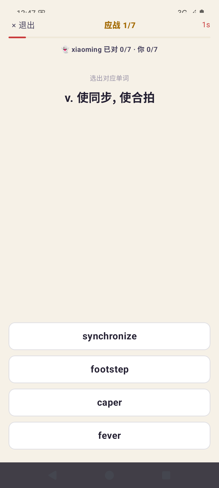
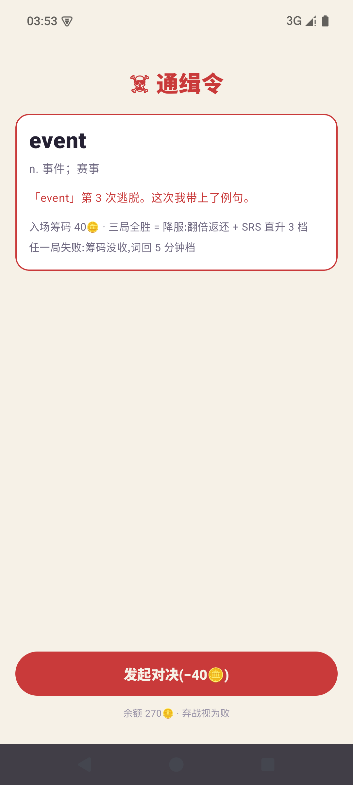
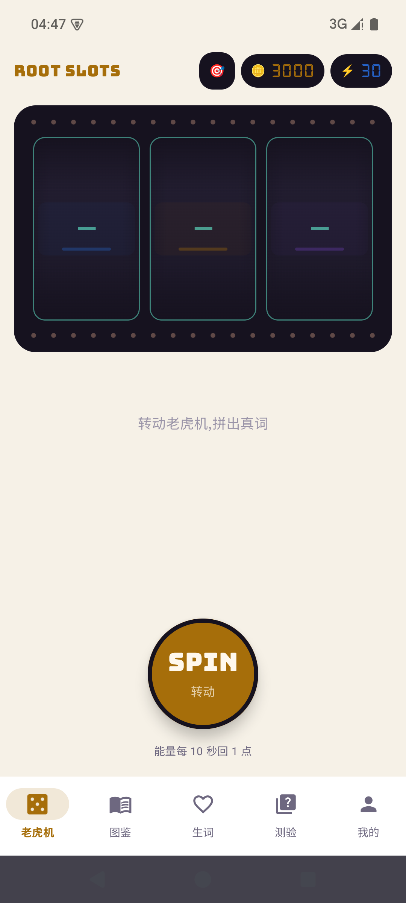

# 🎰 词根老虎机 RootSlots

> 像拉老虎机一样背单词——转轴停下的**必然是词表里的真词**:
> 前缀蓝、词根金、后缀紫,在娱乐中完成构词记忆。


**下载**:到 [Releases](https://github.com/amazing1102/RootSlots/releases) 页面下载最新 `RootSlots-v1.0.1.apk`,Android 8.0+ 直接安装。

---

## ✨ 功能

| 模块 | 说明 |
|---|---|
| 🎰 **动态段轴老虎机** | 轴数 = 词段数(2~4),跑马灯泡带追逐/庆祝、纸面滚筒(回拉-快转-回弹三段停轴)、LED 金币/能量计数;停轴后**落定开考**:4 选 1 猜释义,答对 ×1.5、答错 −3 且词自动进生词本、可跳过拿半价;**生词本逾期词再转出「锈蚀」只值 2 金币**——复习压力直接写进经济系统 |
| ⚔️ **好友 PK · 异步战书** | 完全离线的好友对战:挑 7 词(生词本薄弱 / 词根族 / 随机 / **宿敌指名**)→ 押注托管 → 自己先打一遍生成**战书码**(文本码或**二维码**,微信直传)→ 好友同题应战、答题时追你的**幽灵进度条** → **回执码**回传,零和结算金币划转;全流程无网络、无账号,「我的」页留档战书战绩 |
| ☠️ **宿敌对决(金币消费)** | 遗忘 ≥3 次的词升级为**宿敌**:生词本顶部通缉令卡(悬赏等级 + 嘲讽台词),花筹码发起**三局 Boss 战**(释义选词 → 例句挖空 → 拼写补全);全胜 = 降服:翻倍返还 + 🏅 勋章 + SRS 直升 3 档;败 = 筹码没收、词回 5 分钟档——**最难啃的词拥有 Boss 战叙事** |
| 🎯 **定向转轴 + 机台改装** | 30 币**许愿**指定词根族,下一转必出该族词(刻意的薄弱处练习);机台皮肤三款(纸面 / 鎏金 / 霓虹)纯外观沉淀长线金币 |
| 🔍 **构词详情双形态** | 3730 个组合词 = 分段释义卡(每段的词根含义);其余词 = 整词卡;词根族一键跳转,例句卡(词高亮 + 整句朗读) |
| 🧠 **艾宾浩斯 SRS** | 经典 9 记忆节点(5分钟→30分钟→12小时→1/2/4/7/15/30天),通过即毕业;详情页绘制该词的记忆保持率曲线 |
| ✍️ **四模式测验** | 释义选词 / 看音标选词 / 听音选词 / 拼写补全,覆盖全词表 |
| 📚 **词根图鉴** | 505 个词根族 + 搜索 + 收集进度,转过的词金色点亮 |
| 🎓 **7 考试池** | CET-4/6、高考、考研、雅思、托福、GRE——并集出题,收藏与复习永不受限 |
| 🔊 **离线神经美音** | 内置 sherpa-onnx + Piper(en_US-amy)语音模型,无网也能自然发音;系统 TTS 自动兜底 |
| 📊 **学习统计** | 学习日历热力图(连续达标 🔥)、近 7 天复习量、记忆曲线达成率、遗忘进度条 |
| 🌓 **明暗双主题** | 赌场夜场(墨紫+暖金)/ 纸面暖光(米白+深金),跟随系统或手动锁定 |

## 📸 截图

| 老虎机 | 深色主题 |
|---|---|
|  |  |
| **单词详情**(IPA + 分段 + 记忆曲线) | **我的页**(复习统计 + 设置) |
|  |  |
| **看音标选词** | **词根图鉴** |
|  |  |
| **战书应战**(幽灵进度条) | **宿敌对决**(三局 Boss 战) |
|  |  |
| **霓虹机台皮肤** | |
|  | |

## 🛠️ 技术栈与亮点

- **Kotlin 2.0 + Jetpack Compose**(Material3)+ **Room**(v8,全真迁移)+ **DataStore**,零网络权限、零后端、无账号
- **自研构词数据管线**(Python):从四份词根词缀 md 源表解析,用受约束 DFS + 自动拆词器把 14653 词拆出 **3730 个组合词(0 错误)**;拆不可靠的词自动退回"整词模式",宁可不拆不硬拆
- **CMUdict → 美式 IPA 转换器**:ARPAbet 映射 + 音节 onset 重音插入,覆盖 **98.1%** 词表(14372/14653)
- **例句全量数据**:6710 个主词条各配一句程序化校验过的中英例句(键集/词在句中/查重),复习与宿敌挖空题直接复用
- **异步对战协议**:战书码 = JSON→Deflate→Base64URL + CRC 校验(`RS1.<payload>.<crc32>`,题目与幽灵成绩整体自包含,双方词库版本无依赖);二维码走 zxing 离线生成/识别
- **Room 幂等自愈预填**:`ensurePrefilled()` 不依赖 onCreate 时机;升级走真迁移 + ASSETS_VER 闸门增量补灌,收藏/SRS 永不受损
- **离线神经语音**:`SpeechEngine` 抽象——启动即用系统 TTS,Piper 就绪(约 1.5s)后无感切换;generation 计数实现"新播报打断旧播报"
- **体积工程**:R8 + 资源收缩 + ABI 裁剪(arm64-v8a/x86_64),63MB 语音模型打进 APK 约 139MB

## 🏗️ 数据管线

```
cet4 词表/词根词缀/组合图谱 (md)       ECDICT (340 万词条 sqlite)
        │  tools/build_data.py              │ tools/build_gd.py   (多义项释义 + 考试标签)
        │  (解析 + DFS拆分 + 自动拆词器)      │ tools/build_dict.py (7 考试新词合并去重)
CMUdict ─ tools/build_ipa.py               │
        ▼                                  ▼
assets/{words, morphs, families, combos, ipa}.json   (+ glosses/ sentences/ 批文件)
        │  首次启动幂等预填 · 升级按 ASSETS_VER 增量补灌
        ▼
Room (DB v8: words / morphs / families / combos / favorites / srs / review_logs / duels)
```

数据与代码分离:改 md 源表或释义/例句批文件后跑一遍管线(附校验器 `verify_assets.py`,须 0 错误)即可全量重建。

## 🔨 本地构建

```bash
# 数据管线(md/释义/例句变更后)
python tools/build_ipa.py && python tools/build_gd.py && python tools/build_dict.py \
  && python tools/build_data.py && python tools/verify_assets.py
cp assets/{words,morphs,families,combos}.json RootSlots/app/src/main/assets/

# Debug 构建
cd RootSlots && gradle assembleDebug    # 需 JDK 17,gradle.bat 见 AGENTS.md

# Release 构建(需自备签名:根目录放 keystore.properties + release.keystore)
gradle assembleRelease
```

- 工具链:Android Studio(AGP 8.5.2 / Gradle 8.7 / JDK 17),minSdk 26 / targetSdk 35
- 完整的开发约定、踩坑速查见 [AGENTS.md](AGENTS.md),里程碑与交接快照见 [HANDOFF.md](HANDOFF.md)

## 📄 License

代码以 [MIT](LICENSE) 协议开源;仓库内置的第三方数据/模型保留各自许可(见 LICENSE 附表),
CET-4 词表与释义仅供学习交流。

## 🙏 致谢

- [CMUdict](https://github.com/Alexir/CMUdict)(BSD)— 美式 IPA 数据源
- [ECDICT](https://github.com/skywind3000/ECDICT)(MIT)— 多义项释义与考试标签
- [sherpa-onnx](https://github.com/k2-fsa/sherpa-onnx)(Apache-2.0)+ [Piper voices](https://github.com/rhasspy/piper-voices)(MIT)— 离线神经语音
- [ZXing](https://github.com/zxing/zxing)(Apache-2.0)— 战书二维码
- [Bungee](https://github.com/google/fonts/tree/main/ofl/bungee)(OFL)— 招牌体;[DSEG7](https://github.com/keshikan/DSEG)(OFL)— 七段管 LED 数字体
- [Jetpack Compose](https://developer.android.com/compose) / [Room](https://developer.android.com/training/data-storage/room)

---

* RootSlots 是个人学习与求职展示项目,词表与释义仅供学习交流。
